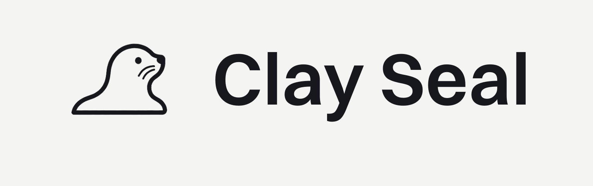

# Clay Seal Identity



[](https://pypi.org/project/clayseal-identity/)
[](https://www.npmjs.com/package/@clayseal/verify)
[](https://pypi.org/project/clayseal-identity/)
[](https://github.com/clayseal/clayseal-identity/actions/workflows/ci.yml)
[](LICENSE)

Clay Seal Identity gives every agent run its own short-lived, verifiable
credential instead of asking agents to borrow a long-lived human or service API
key. It is layer 1 of Clay Seal, published as `clayseal-identity` and imported
from `clayseal.identity`.

Use it when an agent is about to touch real systems and the receiving service
needs to know: who is this agent, who started it, when does this credential
expire, and is the caller holding the workload key the token was bound to?

This repo is intentionally just the identity layer. The next Clay Seal layers,
now in private preview, add runtime capability scoping and receipts for actions
that need stronger enforcement than identity alone can provide.

Use this repo when you need to answer:

- Which agent is acting?
- Which human or service principal delegated that action?
- Is the credential short-lived, signed, and bound to the holder key?
- Can downstream systems verify the identity offline?

## Start Here

Try the zero-config demo from a clone:

```bash
git clone https://github.com/clayseal/clayseal-identity.git
cd clayseal-identity
python -m venv .venv && source .venv/bin/activate
pip install -e ".[dev]"
python examples/01_quickstart.py
python examples/05_inspect_token.py
```

The examples start a throwaway local identity service, mint a demo credential,
validate it, revoke it, and show what the token contains. Nothing touches your
real cloud account, database, or agent system.

Install the SDK in your own app:

```bash
pip install clayseal-identity
```

Add the hosted identity service dependencies only if you plan to run the
FastAPI issuance/validation service yourself:

```bash
pip install "clayseal-identity[server]"
```

| If you want to... | Go here |
| --- | --- |
| issue and validate your first agent token | `examples/01_quickstart.py` |
| inspect what a token says | `examples/05_inspect_token.py` |
| verify a token with only JWKS | [docs/FEDERATION.md](docs/FEDERATION.md) |
| protect FastAPI, MCP, or LangChain-style tools | [docs/INTEGRATIONS.md](docs/INTEGRATIONS.md) |
| run the identity service in production | [docs/DEPLOYMENT.md](docs/DEPLOYMENT.md) |

## What You Get

Implemented today:

- SPIFFE **JWT-SVID** agent credentials (RS256, `sub` = a per-run SPIFFE ID)
  for broad federation compatibility, and SPIFFE **X.509-SVID** certificates
  for mTLS (`identify(..., request_x509=True)`), published with a per-tenant
  trust bundle.
- Ed25519 workload keys for sender-constraining (`cnf.jkt`) and offline
  proof-of-possession.
- SPIFFE-shaped agent identifiers and trust domains.
- Proof-of-possession confirmation claims so a stolen bearer token is not
  enough.
- Scoped tenant API keys (`issuer`, `verifier`, `reader`, `revoker`, `admin`)
  so agents and gateways do not need broad standing authority.
- Biscuit primitives for native Clay Seal capability facts.
- A Python SDK centered on `ClaySeal`.
- An optional FastAPI identity service for centralized issuance and validation.
- SQLite-by-default development storage and Postgres-ready production storage.
- Alembic migrations, API-key hardening, and optional KMS envelope encryption.

> **Attestation model.** Node attestation verifies platform-signed evidence a
> workload cannot forge without controlling the node: a Google-signed GCP
> instance identity token, a Kubernetes projected service-account token (checked
> via the cluster's TokenReview API), or an AWS EC2 instance identity document
> (RSA-2048 signature against AWS's regional certificate). The node token's
> audience binds the workload key being presented, so evidence captured
> elsewhere can't be replayed to bind a different key. For on-prem and bare-metal
> there is also a static trust-anchor attestor (operator-registered key). Enable
> attestors per deployment (see [docs/THREAT_MODEL.md](docs/THREAT_MODEL.md) and
> [docs/DEPLOYMENT.md](docs/DEPLOYMENT.md)).

Layer 1 deliberately does not try to be a complete sandbox. Runtime capability
scoping, stateful budget checks, suspicious-sequence detection, and execution
receipts live in the sibling layers:

| Layer | Repository | Purpose |
| --- | --- | --- |
| L1 | this repo | Agent identity and credential issuance |
| L2 | Clay Seal Capabilities (private preview) | Commit tokens, mandates, leases, budgets |
| L3 | Clay Seal Receipts (private preview) | Verifiable execution receipts and audit |

This package stands alone: it has no dependency on the other layers, and every
runtime dependency resolves from public PyPI.

Known boundaries are tracked in [docs/SECURITY_BACKLOG.md](docs/SECURITY_BACKLOG.md).
The short version: Identity proves who the agent run is and whether the
credential is valid. It is not, by itself, a complete runtime sandbox. For
revocation-sensitive operations, use online validation or server-side
capability authorization instead of purely offline JWT verification.

## Install

The client SDK (`clayseal.identity`) is intentionally lightweight:

```bash
pip install clayseal-identity
```

To also run the bundled FastAPI identity service, add the `server` extra (pulls
in FastAPI, SQLAlchemy, the Postgres driver, and Alembic); `kms` adds the AWS KMS
provider:

```bash
pip install "clayseal-identity[server]"
pip install "clayseal-identity[server,kms]"
```

### From source (development)

```bash
git clone https://github.com/clayseal/clayseal-identity.git
cd clayseal-identity
python -m venv .venv && source .venv/bin/activate
pip install -e ".[dev]"                 # client + server + test/lint/type tooling
pytest backend/tests sdk/python/tests -q
python examples/01_quickstart.py
```

Or run `scripts/bootstrap.sh`, which performs the steps above.

## Good First Places To Help

If you are looking at Clay Seal as an open-source project, the most useful
contributions right now are practical integrations and sharp tests:

- Add a small example for a framework you already use.
- Add a negative test showing a stolen token, wrong audience, replayed proof, or
  mis-scoped key being rejected.
- Improve the local demo path so a new developer can understand it faster.
- Review the threat model and file issues for places where the docs overclaim
  or underspecify deployment assumptions.

See [CONTRIBUTING.md](CONTRIBUTING.md), [SECURITY.md](SECURITY.md), and
[good first issues](https://github.com/clayseal/clayseal-identity/issues?q=is%3Aissue%20state%3Aopen%20label%3A%22good%20first%20issue%22).

## Quickstart

The fastest path is the zero-config embedded demo. It starts a throwaway local
identity service, creates a tenant, identifies an agent, validates the token,
and revokes it. The inspector example prints the token's identity fields without
trusting it:

```bash
python examples/01_quickstart.py
python examples/05_inspect_token.py
python examples/02_capabilities.py
python examples/04_mcp_server.py   # lock down an MCP server (needs the [mcp] extra)
```

### Protect an MCP server

Most MCP servers in the wild are reachable by anything that can open a
connection. With the `[mcp]` extra, a FastMCP server accepts only Clay
Seal-credentialed agents, and each tool call is authorized against the
caller's capability token — attenuation included, so an agent that narrowed
itself mid-task is held to the narrowed rights:

```python
from mcp.server.fastmcp import FastMCP
from clayseal.identity.integrations.mcp_server import (
    ClaySealTokenVerifier, ToolGuard, build_auth_settings,
)

mcp = FastMCP("tools", token_verifier=verifier, auth=auth_settings)

@mcp.tool()
@guard.require()
def search_web(query: str) -> str: ...
```

Details in [docs/INTEGRATIONS.md](docs/INTEGRATIONS.md).

### Framework integrations

Native on-ramps for the frameworks agents actually run in — a JavaScript
verifier (`@clayseal/verify`) for Node MCP servers and OpenClaw tool plugins,
and an [agentskills.io](https://agentskills.io) skill for Hermes Agent. See
[integrations/](integrations).

The package is SDK-first: issue tokens, verify them offline, and wire framework checks through `clayseal.identity` APIs in your application code and tests.

The current SDK flow is service-backed: create or point at a tenant, then call
`identify`. `dev_attestation=True` is only for localhost demos/tests; production
callers pass a platform-issued attestation document.

```python
from clayseal.identity import ClaySeal

tenant = ClaySeal.create_tenant("Acme AI", base_url="http://localhost:8000")
auth = ClaySeal(
    api_key=tenant["api_key"],
    base_url="http://localhost:8000",
    dev_attestation=True,  # localhost demos/tests only
)

session = auth.identify(
    agent_type="researcher",
    owner="alice@example.org",
    capabilities=[{"resource": "repo", "action": "read"}],
)

claims = session.validate().claims
assert claims["sub"].startswith("spiffe://")
```

### Inspect a token

Inspection is for humans and debug screens. It decodes claims without trusting
the token. Use `verify_offline(...)` or `session.validate()` before enforcement.

```python
from clayseal.identity import inspect_token

inspection = inspect_token(session.token)
print("\n".join(inspection.summary_lines()))
```

## Hosted Service

Run the local FastAPI service:

```bash
uvicorn clayseal.backend.main:app --reload
```

Production deployments should run behind TLS, pin issuer and audience, use
Postgres, run Alembic migrations before deploy, and store signing material in a
KMS or equivalent key-management system.

## Privacy and Data Handling

Layer 1 stores and processes identity metadata: agent IDs, trust domains,
principals, credential timestamps, public keys, and operational audit metadata.
Private keys, persisted agent certificates, admin API keys, and database
credentials are secrets.

Read [docs/PRIVACY.md](docs/PRIVACY.md) before integrating with production user
or employee data.

## Documentation

Start with:

- [Developer guide](docs/DEV_GUIDE.md)
- [Identity-only integrations](docs/INTEGRATIONS.md)
- [Security backlog](docs/SECURITY_BACKLOG.md)
- [Deployment checklist](docs/DEPLOYMENT.md)

Reference:

- [Agent identity profile](docs/AGENT_IDENTITY_PROFILE.md)
- [Federation notes](docs/FEDERATION.md)
- [Threat model](docs/THREAT_MODEL.md)
- [Conformance guide](docs/CONFORMANCE.md)
- [Identity profiles](docs/IDENTITY_PROFILES.md)
- [Privacy and data handling](docs/PRIVACY.md)

## Compatibility Note

The public brand is Clay Seal. The package names and import paths intentionally
remain `clayseal-*` / `clayseal.*` for now so existing integrations keep
working.
