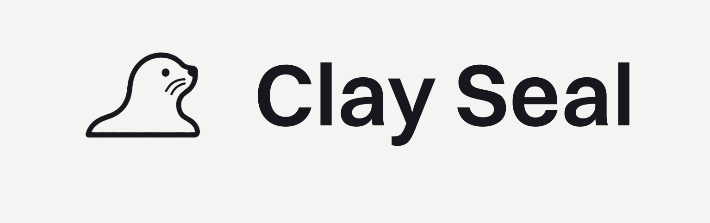

# Clay Seal Identity



[](https://pypi.org/project/clayseal-identity/)
[](https://github.com/clayseal/clayseal-identity/actions/workflows/ci.yml)
[](https://pypi.org/project/clayseal-identity/)
[](LICENSE)

Most agents share an API key. Steal the key, you are the agent. Clay Seal
Identity gives each run its own short-lived attested credential, bound to a
holder key. A stolen token is not enough. You can check who acted without
calling home.

PyPI: [`clayseal-identity`](https://pypi.org/project/clayseal-identity/). Import:
`clayseal.identity`. Receipts live in `clayseal-receipts`. Identity is not a
sandbox by itself.

Attestation, federation, and deployment notes:
[docs/THREAT_MODEL.md](docs/THREAT_MODEL.md),
[docs/DEPLOYMENT.md](docs/DEPLOYMENT.md).

## Install

```bash
pip install clayseal-identity
```

Hosted FastAPI service:

```bash
pip install "clayseal-identity[server]"
pip install "clayseal-identity[server,kms]"
```

From source:

```bash
git clone https://github.com/clayseal/clayseal-identity.git
cd clayseal-identity
python -m venv .venv && source .venv/bin/activate
pip install -e ".[dev]"
pytest backend/tests sdk/python/tests -q
python examples/01_quickstart.py
```

Or `scripts/bootstrap.sh`.

## Quickstart

```bash
python examples/01_quickstart.py
python examples/05_inspect_token.py
python examples/02_capabilities.py
python examples/04_mcp_server.py   # needs the [mcp] extra
```

### Protect an MCP server

```python
from mcp.server.fastmcp import FastMCP
from clayseal.identity.integrations.mcp_server import (
    ClaySealTokenVerifier, ToolGuard, build_auth_settings,
)

mcp = FastMCP("tools", token_verifier=verifier, auth=auth_settings)

@mcp.tool()
@guard.require()
def search_web(query: str) -> str: ...
```

Details in [docs/INTEGRATIONS.md](docs/INTEGRATIONS.md). Framework on-ramps:
[integrations/](integrations).

### Inspect a token

Inspection is for humans. It decodes claims without trusting the token. Use
`verify_offline(...)` or `session.validate()` before enforcement.

```python
from clayseal.identity import inspect_token

inspection = inspect_token(session.token)
print("\n".join(inspection.summary_lines()))
```

## Hosted service

```bash
uvicorn clayseal.backend.main:app --reload
```

Production: TLS, pin issuer and audience, Postgres, Alembic before deploy,
signing material in a KMS.

## Docs

- [Developer guide](docs/DEV_GUIDE.md)
- [Integrations](docs/INTEGRATIONS.md)
- [Deployment](docs/DEPLOYMENT.md)
- [Threat model](docs/THREAT_MODEL.md)
- [Federation](docs/FEDERATION.md)
- [Conformance](docs/CONFORMANCE.md)
- [Privacy](docs/PRIVACY.md)

## Contributing

See [CONTRIBUTING.md](CONTRIBUTING.md) and [CODE_OF_CONDUCT.md](CODE_OF_CONDUCT.md).
Security issues: [SECURITY.md](SECURITY.md). Do not open a public issue.

## License

MIT. See [LICENSE](LICENSE).
